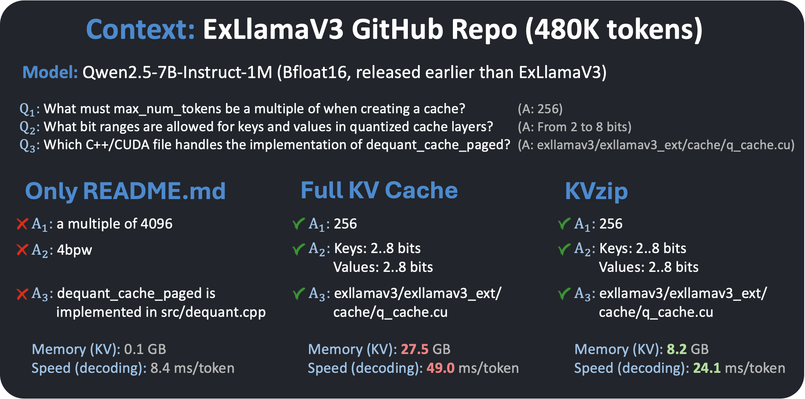

# KVzip: Query-Agnostic KV Cache Compression with Context Reconstruction [NeurIPS'25 Oral]

[[Paper](https://arxiv.org/abs/2505.23416)] [[Blog](https://janghyun1230.github.io/kvzip/)] 


## What's New?
- KVzip compresses the KV cache to support **diverse future queries**.
- [Context-dependent] Achieve a **3–4× reduction in KV cache size** and a **2× decrease in decoding latency**, with minimal performance degradation.
- [Context-independent] Enhance [DuoAttention](https://github.com/mit-han-lab/duo-attention)-style head-level KV compression, using only **a few forward passes within one minute** for head-level importance-score optimization (100x faster).
- Run demo.py:



### Benchmarking on query-agnostic setting
- Tasks: [SQuAD](https://huggingface.co/datasets/rajpurkar/squad), [NIAH](https://github.com/gkamradt/LLMTest_NeedleInAHaystack), [SCBench](https://github.com/microsoft/MInference/tree/main/scbench), [GSM8K](https://huggingface.co/datasets/openai/gsm8k/viewer/main/train?row=7294). 
- Model: [Qwen2.5-7B-Instruct-1M](https://huggingface.co/Qwen/Qwen2.5-7B-Instruct)


## News
- **09/2025**: 🎉 KVzip has been accepted at NeurIPS 2025 as an **Oral Presentation**! 
- **07/2025**: [NVIDIA KVpress](https://github.com/NVIDIA/kvpress) adds support for KVzip (see also [Leaderboard](https://huggingface.co/spaces/nvidia/kvpress-leaderboard)).
- **07/2025**: KVzip is presented at the [ES-FoMo III ICML Workshop](https://es-fomo.com).
- **05/2025**: [arXiv preprint]((https://arxiv.org/abs/2505.23416)) is released.

## Installation
We used CUDA 12.1 and Python 3.10
```bash
cd KVzip
pip install -r requirements.txt
pip install flash-attn==2.7.4.post1 --no-build-isolation
make i
```
- To use [QServe](https://github.com/mit-han-lab/omniserve) quantization, please follow [`./model/quant_model`](https://github.com/snu-mllab/KVzip/tree/main/model/quant_model).


## Quick Start
```python
from model import ModelKVzip

model = ModelKVzip("Qwen/Qwen2.5-7B-Instruct-1M")
context = "This is my basic profile. My name is Kim living in Seoul. My major is computer science."
queries = ["What is my name?", "Do I live in Seoul?"]

kv = model.prefill(context, load_score=False)  # prefill KV cache + importance scoring
kv.prune(ratio=0.3)  # compression ratio, evict 70% KV

for q in queries:
    query_ids = model.apply_template(q)
    output = model.generate(query_ids, kv=kv, update_cache=False)  # efficient inference
    print(q, output)
```
- Supported models are listed in [`model/load.py`](https://github.com/snu-mllab/KVzip/blob/main/model/load.py), including **LLaMA3, Qwen2.5/3, Gemma3**.
- Set `load_score=True` to eliminate compression overhead. This enables context-independent KV eviction, with a trade-off in compression ratio of `ratio=0.6`.
- After generation, KV pairs corresponding to the queries and generated tokens are selectively evicted from the cache for further processing. Set `update_cache=True` to enable multi-turn inference, retaining full interaction histories throughout the inference. 

## Profiling Memory and Computation Time
### Context-dependent eviction
```bash
python -B test.py -m [model_name] -d [data_name] --kv_type evict --ratio 0.3
```
- The code above also compares outputs generated with full versus pruned KV caches.
- To quick test, use `-d squad`. For long-context testing, use `-d scbench_kv`.
  - Available data names: [`data/load.py`](https://github.com/snu-mllab/KVzip/blob/main/data/load.py).
  - Available model names: [`model/load.py`](https://github.com/snu-mllab/KVzip/blob/main/model/load.py), e.g., llama3.1-8b, qwen2.5-7b (or Qwen/Qwen2.5-7B-Instruct-1M).
- We adapt CUDA kernel from [AdaKV](https://github.com/FFY0/AdaKV/tree/main), supporting non-uniform head budget allocation.
  - Currently, our code lacks an optimized kernel for Gemma3 which uses static KV cache, so the code does not yield actual efficiency gains. However, model performance can still be evaluated using reduced attention with KV subsampling (`--kv_type retain`).


### Context-independent eviction (no runtime compression overhead)
- Use the `--level head` flag with `--ratio 0.6` (recommended).
  - We remove all context KV pairs associated with a specific head while retaining system prompt and query KV pairs.
  - Precomputed head scores are available for LLaMA3.1-8B and Qwen2.5-7/14B in `./utils/head_score`.
- To compute head scores for other models:
  ```bash
  python -B test.py -m [model_name] -d scbench_qa_eng --save_head_score
  ```
  - Results will be saved in `./utils/head_score`.
  - If targeting a coding task, we recommend additionally running the command with `-d scbench_repoqa`. This allows the model to use the max head scores from both natural and coding languages, which improves performance.
- These scores can be seamlessly integrated with [DuoAttention](https://github.com/mit-han-lab/duo-attention)'s optimized inference engine by replacing their head score data with ours.


## Evaluation
- To generate model responses with KV compression ratios ranging from 0.1 to 1.0:
    ```bash
    python -B eval.py -m [model_name] -d [data_name] --kv_type retain --num 100
    ``` 
  - Results will be saved in `./results/[data_name]`.
  - Supported datasets are listed in [`data/load.py`](https://github.com/snu-mllab/KVzip/blob/main/data/load.py).
- To compute evaluation metrics from generated results:
  ```bash
  python -B -m results.parse -m [model_name] -d [data_name]
  ```

## Applying to New Models
To integrate KVzip for a new model, you will need to update the following files:
- `attention/attn.py`  
  Modify the attention forward pass logic as needed. In certain cases, updates to kvcache.py and score.py may also be required.
- `model/monkeypatch.py`  
  Implement model-specific monkey patching for integration.
- `model/template.py`   
  Define the model's system prompt and chat formatting templates.


## Citation
```bibtex
@article{kim2025kvzip,
        title={KVzip: Query-Agnostic KV Cache Compression with Context Reconstruction},
        author={Kim, Jang-Hyun and Kim, Jinuk and Kwon, Sangwoo and Lee, Jae W and Yun, Sangdoo and Song, Hyun Oh},
        journal={Advances in Neural Information Processing Systems},
        year={2025}
}
```

## License
MIT License
